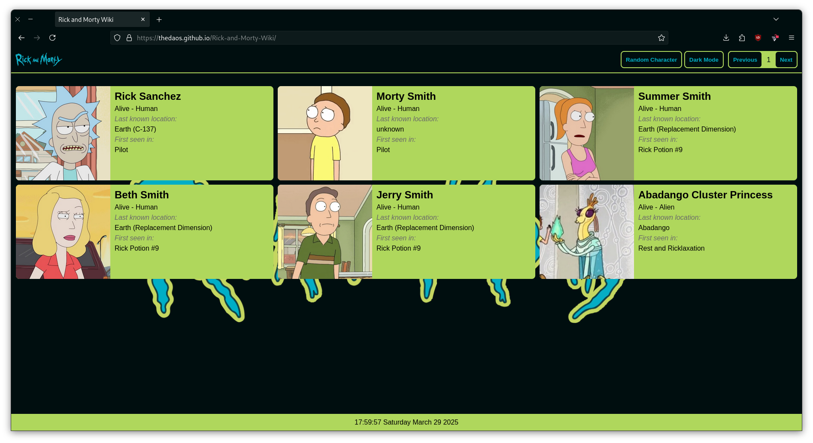
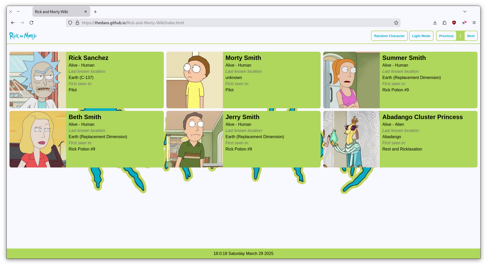
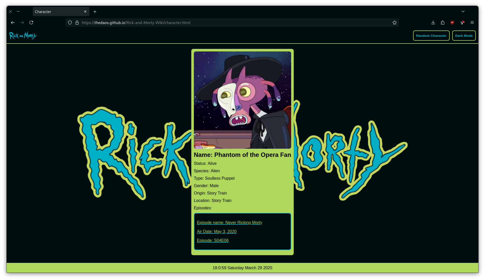
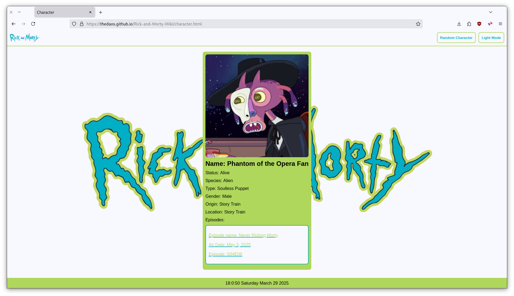

# Rick and Morty Wiki

[GitHub Pages Deployment](https://thedaos.github.io/Rick-and-Morty-Wiki/)   
[Netlify Deployment](https://cheerful-treacle-fb14ff.netlify.app/)

## Description

Rick and Morty Wiki is a fan-made character wiki for the series "Rick and Morty." 
The wiki provides detailed information about each character, including their name, dead or alive, first seen in location, and appeared episodes.

## Setup instructions

To set up the Rick and Morty Wiki locally, follow these steps:

- Clone the Repository: 
    ```bash
       git clone https://github.com/TheDAOS/Rick-and-Morty-Wiki.git
       cd Rick-and-Morty-Wiki
    ```
- live Server:  
    Use any preferred live server and open `index.html` in the live server

## Screenshots

#### Home page Dark Mode


#### Home page Light Mode


#### Character page Dark Mode


#### Character page Light Mode


## challenges

- **API Data Management:** 
    The API provides 20 character data points per call, but I only need 6 per page. This required calling the API multiple times and managing the data to populate 10 pages.

- **Data Transfer Between Pages:** 
    There was some decision-making paralysis regarding how to send chosen character data from the home page to the character page. After considering various factors, I decided to use localStorage for sending data to the character page.
